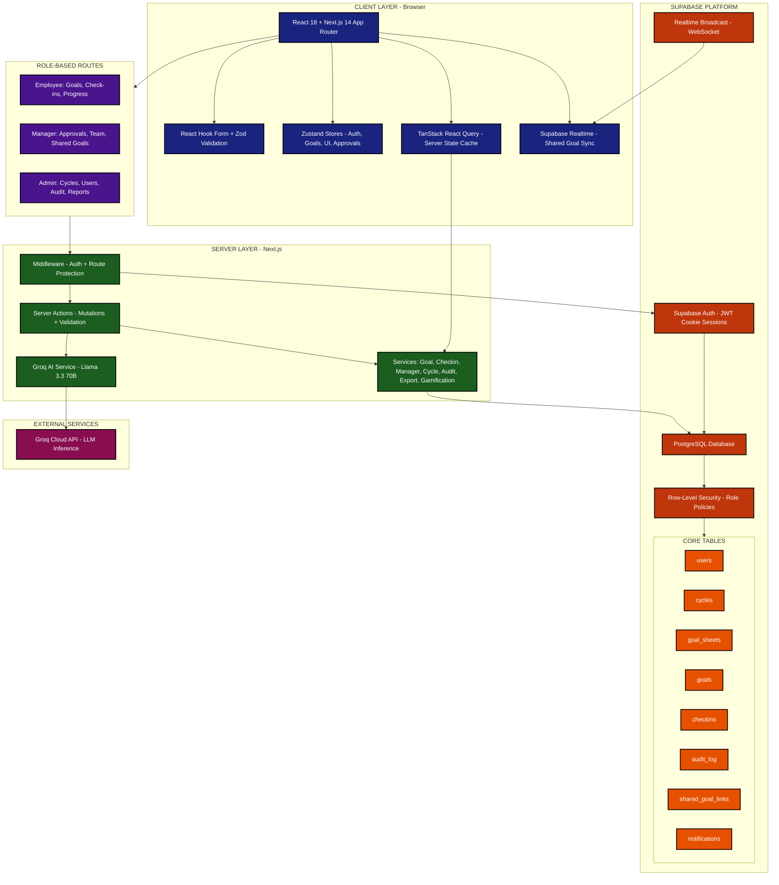

# AtomQuest — Performance Goal Tracking Portal

A comprehensive performance management system built for organizations following the Indian Financial Year (April–March) cycle. Employees set goals, log quarterly check-ins, and track progress while managers approve goal sheets and monitor team performance.

---

## System Architecture



---

## Tech Stack

| Layer | Technology |
|-------|-----------|
| Framework | Next.js 14.2 (App Router, SSR) |
| Language | TypeScript 5.7 |
| UI | React 18, Tailwind CSS, Radix UI, Lucide Icons |
| Forms | React Hook Form + Zod validation |
| State | Zustand (client), TanStack React Query (server) |
| Database | PostgreSQL via Supabase |
| Auth | Supabase Auth (JWT cookies, SSR-safe) |
| Real-time | Supabase Realtime (WebSocket broadcast) |
| AI | Groq Cloud (Llama 3.3 70B) for goal suggestions |
| Export | XLSX / CSV report generation |

---

## Features

### Employee Portal
- Create and manage up to 8 weighted goals per cycle
- Log quarterly check-ins with actual progress values
- AI-powered goal writing assistant
- Progress dashboard with visual indicators
- In-app notifications

### Manager Portal
- Approve or return employee goal sheets
- Monitor team progress and check-ins
- Create shared/cascaded goals across team members
- Team performance reports

### Admin Portal
- Manage performance cycles (Indian FY: Apr–Mar)
- User management with role assignment
- Append-only audit log for compliance
- Unlock locked goal sheets with audit trail
- Organization-wide reports and exports
- Escalation management

---

## Role-Based Access Control

| Role | Access |
|------|--------|
| **Employee** | Own goals, check-ins, progress, profile, notifications |
| **Manager** | Team management, approvals, shared goals, team reports |
| **Admin** | Full system: cycles, users, audit log, reports, settings |

Authorization is enforced at three levels:
1. **Middleware** — Route-level role checks
2. **Row-Level Security** — PostgreSQL RLS policies per role
3. **Server Actions** — Role validation before every mutation

---

## Database Schema

| Table | Purpose |
|-------|---------|
| `users` | Portal users linked to Supabase Auth (role, department, manager) |
| `cycles` | Performance cycles with quarterly date gates |
| `goal_sheets` | Employee goal containers per cycle (draft → submitted → approved) |
| `goals` | Individual goals with UoM, target, weightage (min 10%, total 100%) |
| `checkins` | Quarterly progress entries with auto-computed scores |
| `shared_goal_links` | Junction table for cascaded KPI sync |
| `audit_log` | Immutable compliance ledger (no UPDATE/DELETE) |
| `notifications` | In-app event notifications |

---

## Getting Started

### Prerequisites
- Node.js 18+
- A Supabase project (with Auth enabled)
- Groq API key (for AI features)

### Installation

```bash
# Clone the repository
git clone https://github.com/your-org/atomquest.git
cd atomquest

# Install dependencies
npm install

# Set up environment variables
cp .env.example .env.local
```

### Environment Variables

```env
NEXT_PUBLIC_SUPABASE_URL=your_supabase_url
NEXT_PUBLIC_SUPABASE_ANON_KEY=your_anon_key
SUPABASE_SERVICE_ROLE_KEY=your_service_role_key
GROQ_API_KEY=your_groq_api_key
```

### Database Setup

```bash
# Run migrations (creates tables, indexes, functions, RLS policies, seed data)
npm run db:migrate:seed
```

### Development

```bash
npm run dev        # Start dev server at http://localhost:3000
npm run build      # Production build
npm run lint       # ESLint
npm run type-check # TypeScript validation
```

---

## Project Structure

```
src/
├── app/                    # Next.js App Router
│   ├── (admin)/            # Admin routes
│   ├── (auth)/             # Login/Signup
│   ├── (employee)/         # Employee routes
│   ├── (manager)/          # Manager routes
│   └── actions/            # Server Actions (mutations)
├── components/             # React components by domain
│   ├── admin/              # Admin-specific UI
│   ├── ai/                 # AI goal assistant
│   ├── checkins/           # Check-in forms & views
│   ├── goals/              # Goal cards, forms, sheets
│   ├── manager/            # Manager-specific UI
│   ├── shared/             # Shared components
│   └── ui/                 # Radix-based primitives
├── hooks/                  # Custom React hooks
├── lib/                    # Core utilities
│   ├── ai/                 # Groq AI service
│   ├── auth/               # Session helpers
│   ├── supabase/           # Client/server Supabase instances
│   └── utils/              # Helpers
├── providers/              # Context providers
├── services/               # Data access layer
├── store/                  # Zustand stores
├── types/                  # TypeScript types
└── validations/            # Zod schemas
supabase/
└── migrations/             # SQL migrations (ordered)
```

---

## Key Design Decisions

- **Max 8 goals per sheet** — Enforced by database trigger
- **Weightage rules** — Min 10% per goal, total must equal 100%
- **Progress scoring** — Auto-computed (0–200%) by Postgres trigger based on UoM type
- **Audit immutability** — `audit_log` has no UPDATE/DELETE policies
- **Shared goals** — Real-time broadcast syncs achievement across linked goals
- **AI server-side only** — Groq API key never exposed to client

---

## License

Private — All rights reserved.